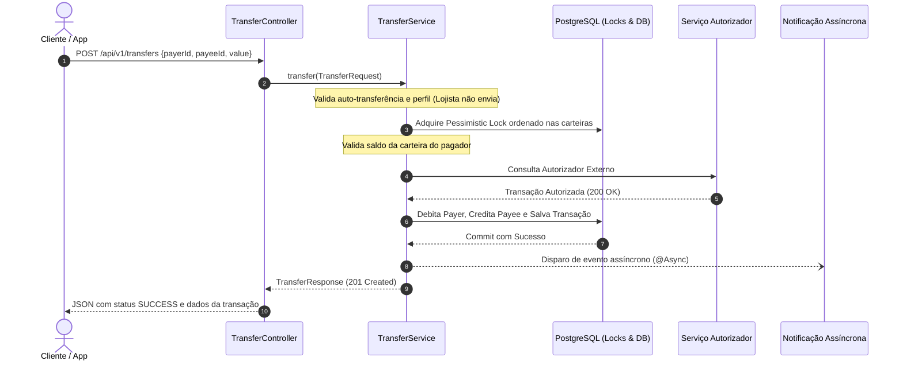

# 💳 PayFlow API — Digital Wallet & Transaction Engine

[](https://openjdk.org/projects/jdk/21/)
[](https://spring.io/projects/spring-boot)
[](https://www.postgresql.org/)
[](https://www.docker.com/)
[](https://opensource.org/licenses/MIT)

> **PayFlow API** é um motor de pagamentos e carteira digital de alta consistência transacional e baixa latência, projetado com **Java 21** e **Spring Boot 3.3**, seguindo os princípios de **Clean Architecture**, **SOLID** e padrões corporativos para prevenção de concorrência e *double spending*.

---

## 🎯 Destaques do Projeto (Recruiter & Tech Lead Showcase)

- 🔒 **Concorrência Segura & Prevenção de Deadlocks**: Implementação de *Pessimistic Write Lock* (`@Lock(LockModeType.PESSIMISTIC_WRITE)`) com ordenação determinística de identificadores de carteiras para evitar condições de corrida (*race conditions*) em transações simultâneas.
- 📐 **Domain-Driven Design (DDD) & Clean Architecture**: Separação clara entre Domínio, Camada de Serviço, Repositórios e DTOs imutáveis baseados em **Java Records**.
- 🚦 **Regras de Negócio Diferenciadas**:
  - Usuários Comuns (`COMMON`): Podem enviar e receber transferências financeiras.
  - Lojistas (`MERCHANT`): Apenas recebem valores de transferências, não podendo enviar.
  - Validação estrita de saldo em conta antes de qualquer débito.
- 🌐 **Tratamento de Exceções RFC 7807**: Respostas de erro padronizadas globalmente via `ProblemDetail` do Spring Boot 3.
- ⚡ **Notificações Assíncronas**: Envio desacoplado e não bloqueante de notificações de transferência via `@Async` com *ThreadPoolTaskExecutor* configurável.
- 🛡️ **Resiliência Externa**: Integração com serviço autorizador externo via `RestClient` do Spring 6 com estratégia de fallback defensivo.
- 📦 **Database Versioning**: Migrações automatizadas de banco de dados gerenciadas com **Flyway**.
- 🐳 **Pronto para Nuvem/Contêineres**: `Dockerfile` multi-stage otimizado e `docker-compose.yml` integrando PostgreSQL 16 e pgAdmin 4.
- 🧪 **Cobertura de Testes Automatizados**: Testes unitários com JUnit 5 + Mockito + AssertJ e testes de integração de API com MockMvc.

---

## 🔄 Fluxo de Transferência (Sequence Diagram)



---

## 🛠️ Tecnologias Utilizadas

- **Java 21 (LTS)** (Virtual Threads ready, Records, Pattern Matching)
- **Spring Boot 3.3.4**
- **Spring Data JPA & Hibernate**
- **Flyway Migration**
- **PostgreSQL 16** & **H2 Database** (para testes e ambiente de desenvolvimento rápido)
- **SpringDoc OpenAPI 3 / Swagger UI**
- **Jakarta Bean Validation**
- **JUnit 5, Mockito & AssertJ**
- **Docker & Docker Compose**

---

## 🚀 Como Executar o Projeto

### Pré-requisitos
- **Java 21** instalado (ou utilize o ambiente Docker)
- **Maven 3.9+** (ou execute via wrapper)
- *(Opcional)* **Docker & Docker Compose**

### Opção 1: Executando Localmente (Perfil Dev com H2)
O projeto vem configurado por padrão com o banco em memória H2 e migrações Flyway já populadas:

```bash
# Compilar e executar os testes
mvn clean test

# Iniciar a aplicação
mvn spring-boot:run
```

A API estará disponível em: `http://localhost:8080`  
Documentação interativa Swagger: **`http://localhost:8080/swagger-ui.html`**  
Console H2: `http://localhost:8080/h2-console` (JDBC URL: `jdbc:h2:mem:payflowdb`, Usuário: `sa`, Senha: em branco)

---

### Opção 2: Executando via Docker Compose (PostgreSQL em Produção)

Para subir a aplicação completa com PostgreSQL 16 e painel pgAdmin:

```bash
docker compose up --build -d
```

- **API:** `http://localhost:8080`
- **pgAdmin:** `http://localhost:5050` (Email: `admin@payflow.com` | Senha: `admin`)

---

## 📖 Endpoints da API (RESTful)

### 1. Usuários (`/api/v1/users`)
| Método | Endpoint | Descrição |
|---|---|---|
| `POST` | `/api/v1/users` | Cadastra novo usuário (`COMMON` ou `MERCHANT`) e provisiona carteira |
| `GET` | `/api/v1/users/{id}` | Busca usuário por ID |
| `GET` | `/api/v1/users` | Lista todos os usuários cadastrados |

#### Exemplo de Payload - Cadastro de Usuário:
```json
{
  "fullName": "Mariana Costa",
  "document": "12345678910",
  "email": "mariana.costa@email.com",
  "password": "SenhaSegura@123",
  "userType": "COMMON",
  "initialBalance": 1000.00
}
```

---

### 2. Transferências (`/api/v1/transfers`)
| Método | Endpoint | Descrição |
|---|---|---|
| `POST` | `/api/v1/transfers` | Executa transferência financeira atômica entre carteiras |

#### Exemplo de Payload - Transferência:
```json
{
  "payerId": 1,
  "payeeId": 2,
  "value": 150.00
}
```

#### Resposta de Sucesso (`201 Created`):
```json
{
  "transactionId": 1,
  "payerId": 1,
  "payerName": "Alice Silva",
  "payeeId": 2,
  "payeeName": "Bob Santos",
  "amount": 150.00,
  "status": "SUCCESS",
  "message": "Transferência realizada com sucesso!",
  "timestamp": "2026-09-30T20:30:00"
}
```

---

### 3. Carteiras & Extrato (`/api/v1/wallets`)
| Método | Endpoint | Descrição |
|---|---|---|
| `GET` | `/api/v1/wallets/users/{userId}` | Consulta saldo e dados da carteira do usuário |
| `POST` | `/api/v1/wallets/deposit` | Realiza aporte de capital / depósito em uma carteira |
| `GET` | `/api/v1/wallets/users/{userId}/statement` | Retorna o extrato de movimentações do usuário |

---

## 🧪 Executando os Testes Automatizados

O projeto conta com testes unitários focados nas regras de negócio e testes de integração com MockMvc:

```bash
mvn test
```

Cenários cobertos nos testes:
- ✅ Transferência bem-sucedida entre usuários comuns
- 🚫 Bloqueio de lojista tentando enviar transferência
- 🚫 Bloqueio de auto-transferência para a mesma conta
- 🚫 Rejeição de transação por saldo insuficiente
- 🚫 Transação marcada como `FAILED` caso o autorizador externo recuse
- 🛡️ Validação de formato de requisição via MockMvc

---

## 👨‍💻 Autor

Desenvolvido por **Daniel Fernando Martins**  
- Email: [dfernandom@outlook.com](mailto:dfernandom@outlook.com)  
- GitHub: [github.com/danielfernandomartins](https://github.com/danielfernandomartins)  
- Repositório: [payflow-api](https://github.com/danielfernandomartins/payflow-api)  

---

## 📄 Licença

Distribuído sob a licença [MIT](LICENSE). Consulte o arquivo `LICENSE` para obter mais informações.
